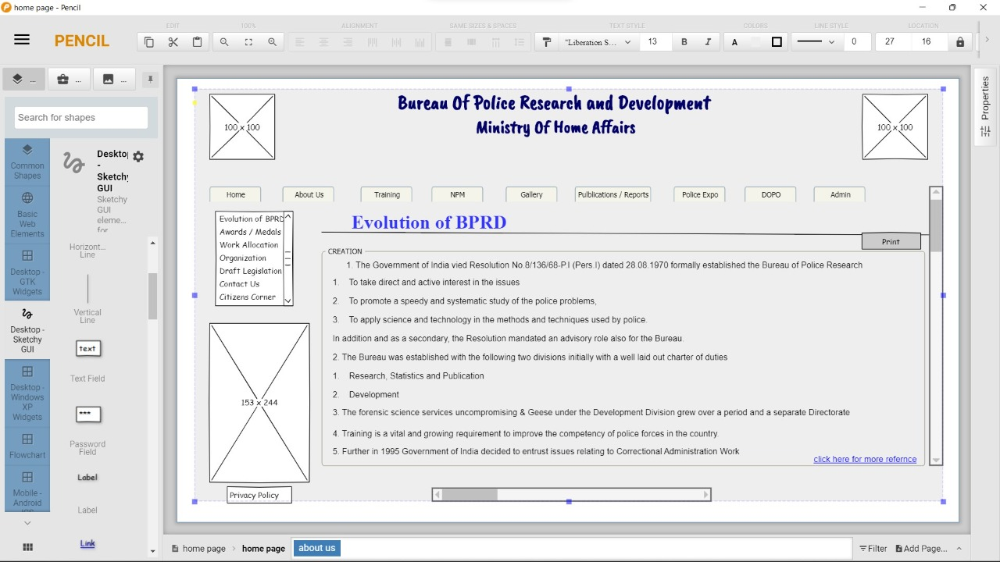

# Wire frame for a website

## AIM:
To design a wire frame for a website.

## DESIGN STEPS:
```
Step 1:
The design is done using Pencil project application.

Step 2:
The pane , group box , top header , text field and many tools are used from the WEB DEVELOPMENTS & DESKTOP-SKETCHY GUI.
```
## OUTPUT:




## Result:
Thus a wire frame is designed for a given website.
